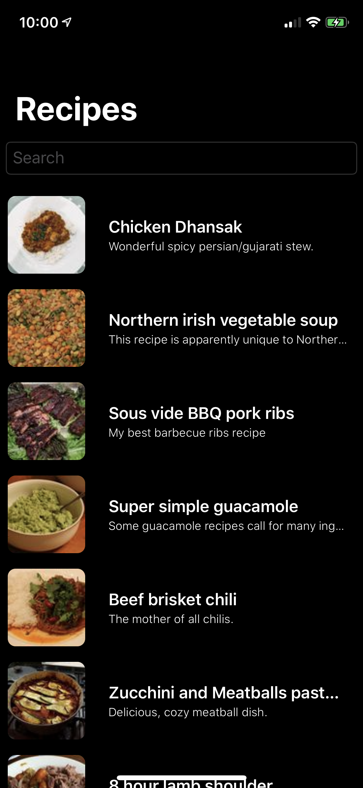

# SwiftUI-Recipes 🍽

A demo app showing how to fetch data from the server to populate list views, navigate to detailed results and wire in a search field.

### About
This project is a SwiftUI implementation of my goto recipe app example for playing around in new languages / environments.

### Usage
1. Clone or download this project
2. Navigate to its directory and open the project file in Xcode 11 or above
3. Build and run to a device or simulator

Made by <a href="https://twitter.com/dps">dps</a> with inspiration from Apple's samples and Mat Schmid's SwiftUI-ListFetching demo.

